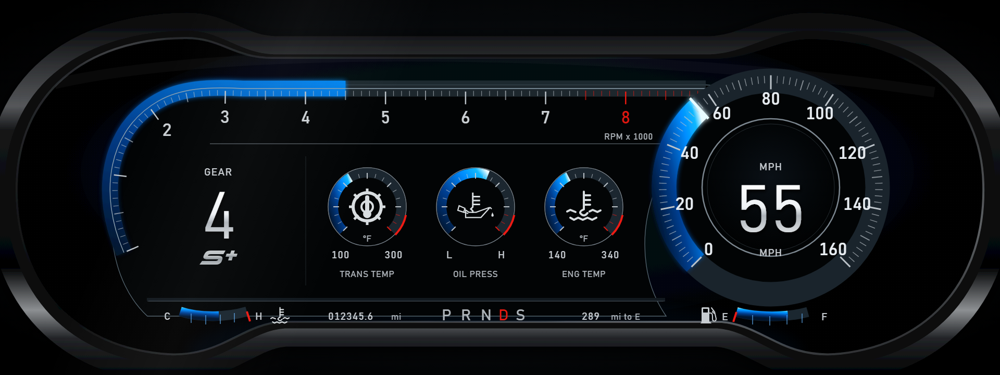

# Dashboard design reference

[MustangDashboard_992026.html](MustangDashboard_992026.html) is the local copy of the user-supplied HTML design, kept here so it can be opened and compared without downloading it again.

The React dashboard ports its 1920 × 720 SVG geometry, gradients, bezel, font stack and proportional scaling. Values come from the existing WebSocket hook. The gear selector spaces each letter separately to avoid the reference's overlapping N/D labels and highlights the current selection. The oil-pressure icon follows the user's subsequent screenshot: an upright oil can with a left handle, thermometer markings and a separate falling drop. The badge below the gear uses the later screenshot's rounded, italic silver **S+** symbol, drawn as SVG paths. The engine-temperature icon follows its supplied screenshot, with a single thermometer stem, three right-hand markings and two rows of waves. The fuel icon uses the supplied screenshot's solid pump body, rectangular display, flared base and curved hose.

The engine and coolant indicators share the same thermometer-and-waves SVG component. The coolant symbol is scaled to fit the bottom information bar.

The oil symbol uses a shared SVG component in the dashboard and oil-temperature mini gauge. Its refined outline follows the pasted reference's smaller handle, shallow can, bent spout, angular thermometer base and separate drop.

The reference's middle gauge is **oil pressure**, with a 0–100 scale. It reads the optional `OilPressure` telemetry field; missing pressure leaves the arc empty and its accessible label says it is unavailable. `OilTemp` is not used as a pressure reading.

The preview uses the HTML's sample readings through a simulated WebSocket: 55 mph, 4,500 RPM, gear 4, transmission 178°F, oil pressure 58, engine 220°F, coolant 58%, fuel 72%, odometer 012345.6 mi and range 289 mi. These are comparison fixtures, not application defaults.

The initial HTML port passed the production build and 25 frontend tests. Its browser checks confirmed matching RPM marker coordinates and speed arc geometry, working telemetry/unit/gear updates, and no page overflow at 1920 × 720, 2550 × 1212, 1280 × 480, 800 × 480 and 390 × 844. The subsequent icon and S+ badge changes were checked with production builds and inspected in Chrome; the preview above includes those changes. Screenshots use reduced motion.
